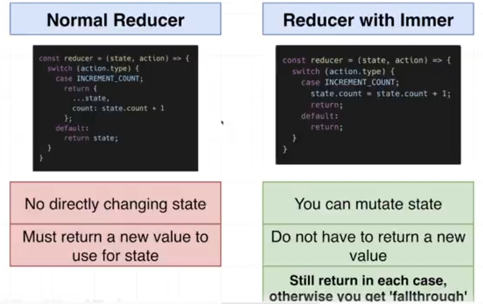

## getting started with projects

1. pics
2. books
3. deep-dive-hooks
4. comps

**useEffect usecases:**

 

**useCallback**


**js demo**


**useRef:**


**Navigation forward backward clicks**


**Sorting Number:**

``` js
let numbers = [42, 3, 100, 8];
numbers.sort((a, b) => a - b);
console.log(numbers); // Output: [3, 8, 42, 100]
```

Here, `(a, b) => a - b` ensures that:
- If `a - b` is negative, a appears before b.
- If `a - b` is positive, b appears before a.


> for descending order, change like this: 
> numbers.sort((a, b) => b - a);

**Sorting String:**

``` js
const data = [ 't', 'A', 'a', 'B', 'b']
data.sort() // output: ['A', 'B', 'a', 'b', 't']

data.sort( (a, b) =>  a.localeCompare(b) ) // output: ['a', 'A', 'b', 'B', 't']
```

**Object Sorting:**

String: 


integer:


**useReducer Demo exp:**


 

**reducer vs immer:**




